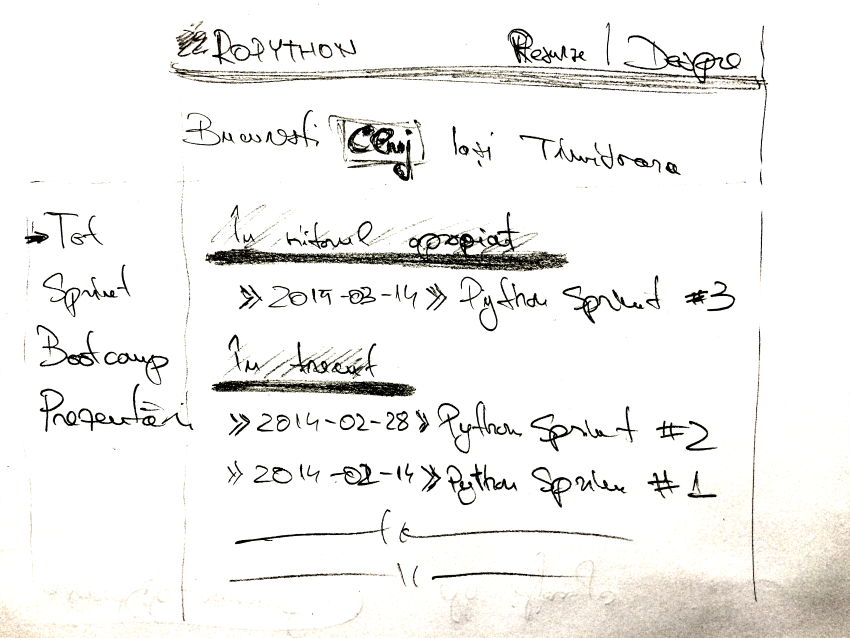
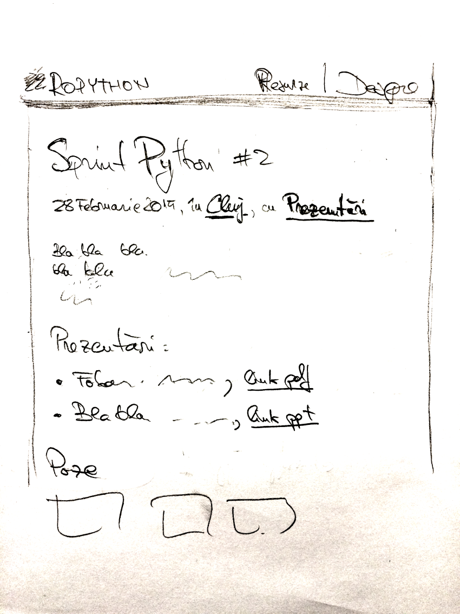

======
Notițe
======

Notițe discuții de la sprint.

Idei pentru http://ropython.org
===============================

Site static generat cu Pelican: locatiile ca si categorii, tipul evenimentului ca si taguri.

Macheta lista evenimente:

Macheta eveniment:

Idei de evenimente
==================

Bootcamp
--------

Cu tematică mai concretă ("cum să iți instalezi Python și să faci <obiectiv>"):

* Cum să faci o pagina web
* Twitter clone (Django howto)
* Pentesting cu Python (cum să folosești Python să găsești probleme de securitate)
* Interfețe grafice (Tkinter, Qt, Kivy; chestiuni simpliste).

Idei de organizare:

* Locații: ceva mai izolat (eg: cabana, acasa la cineva).

Prezentari
----------

* Introduce în semantic web / RDF (Ana Ghiran <anamaria.ghiran@econ.ubbcluj.ro>).
* Testare cu ``pytest`` (Ionel).

Formular de feedback pentru întâlniri
-------------------------------------

Ne putem înbunătăți evenimentele dacă am avea un formular de feedback.

Propunere inițială pentru întrebări:

* Evenimentul a atins obiectivele propuse? Da/Nu
* Dacă "Nu", ce a lipsit?
* Cum ți s-a părut evenimentul in general? [1-5]
* Cum ți s-a părut spatiul/sala? [1-5]
* Cum ți s-a părut mâncarea/băutura? [1-5]
* Cum ți s-a părut prezetarea X? [1-5]
* Cum ți s-a părut prezetarea Y? [1-5]
* Cum ți s-a părut prezetarea Z? [1-5]
* Cum ai aflat de eveniment? Meetup.com/Prieteni/Google/Listă de mail/IRC/User group/Facebook/Twitter/altceva
* Dacă "altceva", ce?
* Mai vii și la urmatorul eveniment? Da/Nu
* Alte sugestii/reclamații/laude?

Centru resurse Python
---------------------

O sectiune in ropython.org cu resurse pentru incepatori, dar care sa te ia de la 0 pana la un nivel in care
poti sa iti alegit niste issues ale unor proiecte open-source(pylint/celery/CPython) si poti sa lucrezi pe ele.

Un fel de CodeAcademy, mai avansat, care sa se termine ori cu un proiect, ori cu issues concrete pe proiecte open-source.

Concursuri
----------
algoritmica, hackathons, contributor of the month

Code Dojo
---------
Implicare in Dojo-urile locale cu focus pe Python

Meetups
-------
Toate intalniriile sa fie inregistrate

Sprints
-------

* categorie despre cum contribui la: pylint / CPython
* issues pe categori de oameni (incepatori / avansati)
* sa ne vedem tot la 2 saptamani

Workshops
---------

* cum contribui la open-source
* programare concurenta
